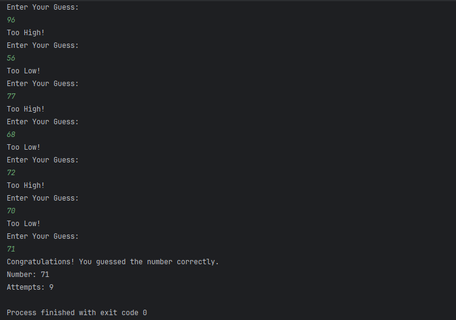

# Number Guessing Game - Java

## Internship Track
SkillCraft Technology - Software Engineering (Task 2)

## Description
A Java console-based interactive number guessing game where the program generates a random number and challenges the user to guess it.

## Features
- Random number generation
- Hint system (Too High / Too Low)
- Attempt counter
- Clean console output

## Technologies Used
- Java
- Random Class
- Loops & Conditionals

## How to Run
1. Compile:
   javac GuessNumber.java
2. Run:
   java GuessNumber

## Learning Outcome
- Logical condition building
- Control flow handling
- Interactive console applications

  ## Screenshot

